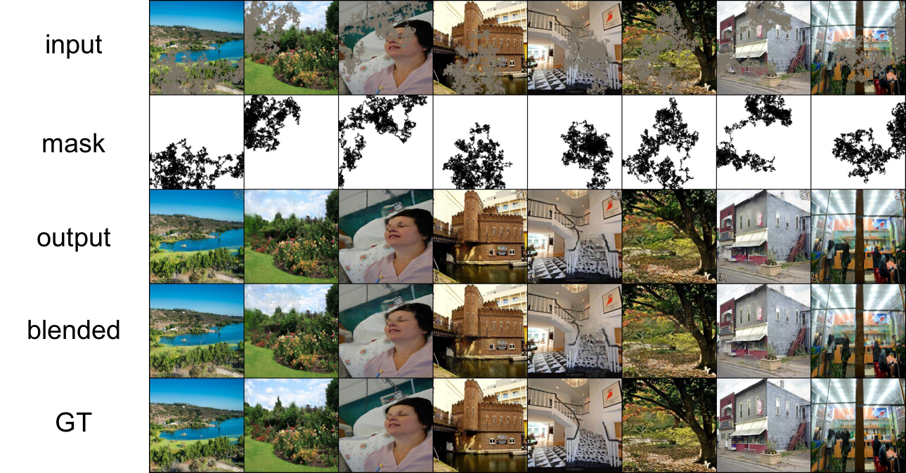

# pytorch-inpainting-with-partial-conv

**Note that this is an ongoing project and I cannot fully reproduce the results. Suggestions and PRs are welcome!**

This is an unofficial pytorch implementation of a paper, Image Inpainting for Irregular Holes Using Partial Convolutions' [Liu+, arXiv2018].

## Requirements
- Python3.6
- Pytorch 0.4.0

```
pip install -r requirements.txt
```

## Usage

### Preprocesse 
Generate masks by following [2] (saved under `./masks` by default).

**Note that the way of the mask generation is different from the original work [1]**

```
python generate_data.py
```

### Train
```
CUDA_VISIBLE_DEVICES=$(nvidia-empty) python train.py
```

### Fine-tune
```
CUDA_VISIBLE_DEVICES=$(nvidia-empty) python train.py --finetune --resume <checkpoint_name>
```

## Results

Here are some results from the test set after the training of 200,000 iterations.


## TODO
- [] Fine-tuning (fix BN params in encoder)
- [] Check the quality

## References
- [1]: G. Liu et al. "Image Inpainting for Irregular Holes Using Partial Convolutions", in arXiv, 2018.
- [2]: [Unofficial implementation in Chainer](https://github.com/SeitaroShinagawa/chainer-partial_convolution_image_inpainting)
