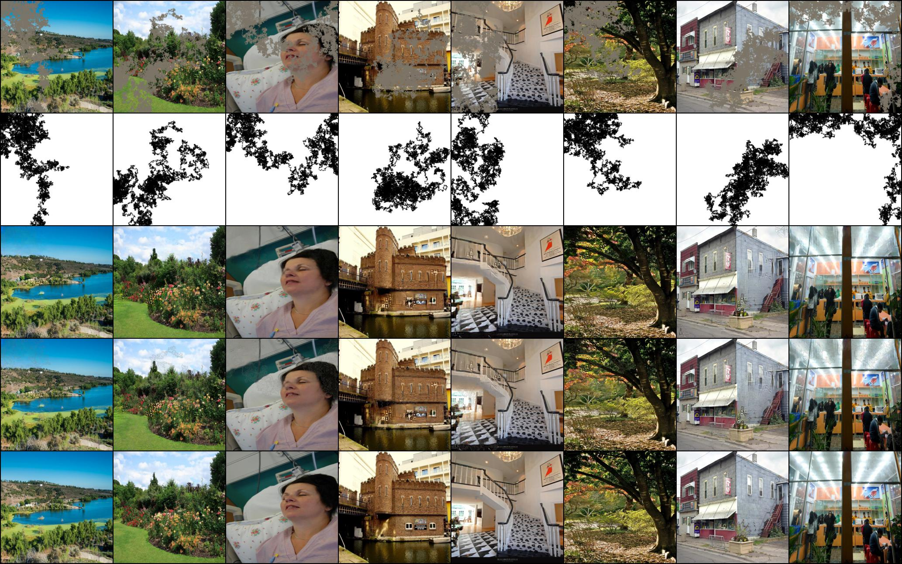

# pytorch-inpainting-with-partial-conv

**[Official implementation](https://github.com/NVIDIA/partialconv) is released by the authors.**

**Note that this is an ongoing re-implementation and I cannot fully reproduce the results. Suggestions and PRs are welcome!**

This is an unofficial pytorch implementation of a paper, [Image Inpainting for Irregular Holes Using Partial Convolutions](https://arxiv.org/abs/1804.07723) [Liu+, arXiv2018].

## Requirements
- Python 3.6+
- Pytorch 0.4.1+

```
pip install -r requirements.txt
```

## Usage

### Preprocess 
- download [Places2](http://places2.csail.mit.edu/) and place it somewhere. The dataset should contain `data_large`, `val_large`, and `test_large` as the subdirectories. Don't forget to specify the root of the dataset by `--root ROOT` when using `train.py` or `test.py`

- Generate masks by following [1] (saved under `./masks` by default). **Note that the way of the mask generation is different from the original work**
```
python generate_data.py
```

### Train
```
CUDA_VISIBLE_DEVICES=<gpu_id> python train.py
```

### Fine-tune
```
CUDA_VISIBLE_DEVICES=<gpu_id> python train.py --finetune --resume <checkpoint_name>
```
### Test
```
CUDA_VISIBLE_DEVICES=<gpu_id> python test.py --snapshot <snapshot_path>
```

## Results

Here are some results from the test set after the training of 500,000 iterations and fine-tuning (freezing BN in encoder) of 500,000 iterations. The model is available [here](https://drive.google.com/open?id=1SYjJ-Vlu2cpAlgBG5FiJueN9W4lf48w8), but I don't ensure the quality.
(Top to bottom: input, mask, image generated by the network, image which is combined with the original non-masked region of image, ground truth)


## References
- [1]: [Unofficial implementation in Chainer](https://github.com/SeitaroShinagawa/chainer-partial_convolution_image_inpainting)
